```mermaid
flowchart TB
    subgraph current["Api.csproj"]
        MAIN["<b>📦&nbsp;Api.csproj</b><br/><small>net9.0</small>"]
        click MAIN "#apiapicsproj"
    end

```

```mermaid
flowchart TB
    subgraph current["MeterKloud.csproj"]
        MAIN["<b>📦&nbsp;MeterKloud.csproj</b><br/><small>net9.0</small>"]
        click MAIN "#clientmeterkloudcsproj"
    end
    subgraph downstream["Dependencies (1"]
        P3["<b>📦&nbsp;MeterDataLib.csproj</b><br/><small>net9.0</small>"]
        click P3 "#meterdatalibmeterdatalibcsproj"
    end
    MAIN --> P3

```

```mermaid
flowchart TB
    subgraph upstream["Dependants (2)"]
        P1["<b>📦&nbsp;MeterKloud.csproj</b><br/><small>net9.0</small>"]
        P4["<b>📦&nbsp;TestMeterLib.csproj</b><br/><small>net9.0</small>"]
        click P1 "#clientmeterkloudcsproj"
        click P4 "#testmeterlibtestmeterlibcsproj"
    end
    subgraph current["MeterDataLib.csproj"]
        MAIN["<b>📦&nbsp;MeterDataLib.csproj</b><br/><small>net9.0</small>"]
        click MAIN "#meterdatalibmeterdatalibcsproj"
    end
    P1 --> MAIN
    P4 --> MAIN

```

```mermaid
flowchart TB
    subgraph current["TestMeterLib.csproj"]
        MAIN["<b>📦&nbsp;TestMeterLib.csproj</b><br/><small>net9.0</small>"]
        click MAIN "#testmeterlibtestmeterlibcsproj"
    end
    subgraph downstream["Dependencies (1"]
        P3["<b>📦&nbsp;MeterDataLib.csproj</b><br/><small>net9.0</small>"]
        click P3 "#meterdatalibmeterdatalibcsproj"
    end
    MAIN --> P3

```

# Projects and dependencies analysis

This document provides a comprehensive overview of the projects and their dependencies in the context of upgrading to .NETCoreApp,Version=v10.0.

## Table of Contents

- [Executive Summary](#executive-Summary)
  - [Highlevel Metrics](#highlevel-metrics)
  - [Projects Compatibility](#projects-compatibility)
  - [Package Compatibility](#package-compatibility)
  - [API Compatibility](#api-compatibility)
- [Aggregate NuGet packages details](#aggregate-nuget-packages-details)
- [Top API Migration Challenges](#top-api-migration-challenges)
  - [Technologies and Features](#technologies-and-features)
  - [Most Frequent API Issues](#most-frequent-api-issues)
- [Projects Relationship Graph](#projects-relationship-graph)
- [Project Details](#project-details)

  - [Api\Api.csproj](#apiapicsproj)
  - [Client\MeterKloud.csproj](#clientmeterkloudcsproj)
  - [MeterDataLib\MeterDataLib.csproj](#meterdatalibmeterdatalibcsproj)
  - [TestMeterLib\TestMeterLib.csproj](#testmeterlibtestmeterlibcsproj)

## Executive Summary

### Highlevel Metrics

| Metric | Count | Status |
| :--- | :---: | :--- |
| Total Projects | 4 | All require upgrade |
| Total NuGet Packages | 23 | 10 need upgrade |
| Total Code Files | 92 |  |
| Total Code Files with Incidents | 6 |  |
| Total Lines of Code | 13883 |  |
| Total Number of Issues | 22 |  |
| Estimated LOC to modify | 4+ | at least 0.0% of codebase |

### Projects Compatibility

| Project | Target Framework | Difficulty | Package Issues | API Issues | Est. LOC Impact | Description |
| :--- | :---: | :---: | :---: | :---: | :---: | :--- |
| [Api\Api.csproj](#apiapicsproj) | net9.0 | 🟢 Low | 6 | 1 | 1+ | AzureFunctions, Sdk Style = True |
| [Client\MeterKloud.csproj](#clientmeterkloudcsproj) | net9.0 | 🟢 Low | 6 | 3 | 3+ | AspNetCore, Sdk Style = True |
| [MeterDataLib\MeterDataLib.csproj](#meterdatalibmeterdatalibcsproj) | net9.0 | 🟢 Low | 1 | 0 |  | ClassLibrary, Sdk Style = True |
| [TestMeterLib\TestMeterLib.csproj](#testmeterlibtestmeterlibcsproj) | net9.0 | 🟢 Low | 0 | 0 |  | DotNetCoreApp, Sdk Style = True |

### Package Compatibility

| Status | Count | Percentage |
| :--- | :---: | :---: |
| ✅ Compatible | 13 | 56.5% |
| ⚠️ Incompatible | 0 | 0.0% |
| 🔄 Upgrade Recommended | 10 | 43.5% |
| ***Total NuGet Packages*** | ***23*** | ***100%*** |

### API Compatibility

| Category | Count | Impact |
| :--- | :---: | :--- |
| 🔴 Binary Incompatible | 0 | High - Require code changes |
| 🟡 Source Incompatible | 0 | Medium - Needs re-compilation and potential conflicting API error fixing |
| 🔵 Behavioral change | 4 | Low - Behavioral changes that may require testing at runtime |
| ✅ Compatible | 25265 |  |
| ***Total APIs Analyzed*** | ***25269*** |  |

## Aggregate NuGet packages details

| Package | Current Version | Suggested Version | Projects | Description |
| :--- | :---: | :---: | :--- | :--- |
| AnthonyChu.AzureStaticWebApps.Blazor.Authentication | 0.0.2-preview |  | [MeterKloud.csproj](#clientmeterkloudcsproj) | ✅Compatible |
| Blazored.LocalStorage | 4.5.0 |  | [MeterKloud.csproj](#clientmeterkloudcsproj) | ✅Compatible |
| coverlet.collector | 6.0.4 |  | [TestMeterLib.csproj](#testmeterlibtestmeterlibcsproj) | ✅Compatible |
| ExcelDataReader | 3.8.0 |  | [MeterDataLib.csproj](#meterdatalibmeterdatalibcsproj) | ✅Compatible |
| FluentAssertions | 8.8.0 |  | [TestMeterLib.csproj](#testmeterlibtestmeterlibcsproj) | ✅Compatible |
| Microsoft.ApplicationInsights.WorkerService | 2.23.0 |  | [Api.csproj](#apiapicsproj) | ✅Compatible |
| Microsoft.AspNetCore.Components.WebAssembly | 9.0.10 | 10.0.1 | [MeterKloud.csproj](#clientmeterkloudcsproj) | NuGet package upgrade is recommended |
| Microsoft.AspNetCore.Components.WebAssembly.Authentication | 9.0.10 | 10.0.1 | [MeterKloud.csproj](#clientmeterkloudcsproj) | NuGet package upgrade is recommended |
| Microsoft.AspNetCore.Components.WebAssembly.DevServer | 9.0.10 | 10.0.1 | [MeterKloud.csproj](#clientmeterkloudcsproj) | NuGet package upgrade is recommended |
| Microsoft.Azure.Functions.Worker | 2.2.0 | 2.51.0 | [Api.csproj](#apiapicsproj) | NuGet package upgrade is recommended |
| Microsoft.Azure.Functions.Worker.ApplicationInsights | 2.0.0 | 2.50.0 | [Api.csproj](#apiapicsproj) | NuGet package upgrade is recommended |
| Microsoft.Azure.Functions.Worker.Extensions.Http | 3.3.0 |  | [Api.csproj](#apiapicsproj) | ✅Compatible |
| Microsoft.Azure.Functions.Worker.Extensions.Http.AspNetCore | 2.1.0 |  | [Api.csproj](#apiapicsproj) | ✅Compatible |
| Microsoft.Azure.Functions.Worker.Sdk | 2.0.6 | 2.0.7 | [Api.csproj](#apiapicsproj) | NuGet package upgrade is recommended |
| Microsoft.Extensions.Caching.Memory | 9.0.10 | 10.0.1 | [Api.csproj](#apiapicsproj) [MeterKloud.csproj](#clientmeterkloudcsproj) | NuGet package upgrade is recommended |
| Microsoft.Extensions.Http | 9.0.10 | 10.0.1 | [Api.csproj](#apiapicsproj) [MeterKloud.csproj](#clientmeterkloudcsproj) | NuGet package upgrade is recommended |
| Microsoft.Extensions.Logging.Abstractions | 9.0.10 | 10.0.1 | [MeterDataLib.csproj](#meterdatalibmeterdatalibcsproj) | NuGet package upgrade is recommended |
| Microsoft.NET.Test.Sdk | 18.0.0 |  | [TestMeterLib.csproj](#testmeterlibtestmeterlibcsproj) | ✅Compatible |
| MudBlazor | 8.14.0 |  | [MeterKloud.csproj](#clientmeterkloudcsproj) | ✅Compatible |
| Plotly.Blazor | 6.0.2 |  | [MeterKloud.csproj](#clientmeterkloudcsproj) | ✅Compatible |
| System.Text.Encodings.Web | 9.0.10 | 10.0.1 | [Api.csproj](#apiapicsproj) [MeterKloud.csproj](#clientmeterkloudcsproj) | NuGet package upgrade is recommended |
| xunit | 2.9.3 |  | [TestMeterLib.csproj](#testmeterlibtestmeterlibcsproj) | ✅Compatible |
| xunit.runner.visualstudio | 3.1.5 |  | [TestMeterLib.csproj](#testmeterlibtestmeterlibcsproj) | ✅Compatible |

## Top API Migration Challenges

### Technologies and Features

| Technology | Issues | Percentage | Migration Path |
| :--- | :---: | :---: | :--- |

### Most Frequent API Issues

| API | Count | Percentage | Category |
| :--- | :---: | :---: | :--- |
| T:System.Uri | 2 | 50.0% | Behavioral Change |
| T:Microsoft.Extensions.Hosting.HostBuilder | 1 | 25.0% | Behavioral Change |
| M:System.Uri.#ctor(System.String) | 1 | 25.0% | Behavioral Change |

## Projects Relationship Graph

Legend:
📦 SDK-style project
⚙️ Classic project

```mermaid
flowchart LR
    P1["<b>📦&nbsp;MeterKloud.csproj</b><br/><small>net9.0</small>"]
    P2["<b>📦&nbsp;Api.csproj</b><br/><small>net9.0</small>"]
    P3["<b>📦&nbsp;MeterDataLib.csproj</b><br/><small>net9.0</small>"]
    P4["<b>📦&nbsp;TestMeterLib.csproj</b><br/><small>net9.0</small>"]
    P1 --> P3
    P4 --> P3
    click P1 "#clientmeterkloudcsproj"
    click P2 "#apiapicsproj"
    click P3 "#meterdatalibmeterdatalibcsproj"
    click P4 "#testmeterlibtestmeterlibcsproj"

```

## Project Details

### Api\Api.csproj

#### Project Info

- **Current Target Framework:** net9.0
- **Proposed Target Framework:** net10.0
- **SDK-style**: True
- **Project Kind:** AzureFunctions
- **Dependencies**: 0
- **Dependants**: 0
- **Number of Files**: 2
- **Number of Files with Incidents**: 2
- **Lines of Code**: 38
- **Estimated LOC to modify**: 1+ (at least 2.6% of the project)

#### Dependency Graph

Legend:
📦 SDK-style project
⚙️ Classic project

### API Compatibility

| Category | Count | Impact |
| :--- | :---: | :--- |
| 🔴 Binary Incompatible | 0 | High - Require code changes |
| 🟡 Source Incompatible | 0 | Medium - Needs re-compilation and potential conflicting API error fixing |
| 🔵 Behavioral change | 1 | Low - Behavioral changes that may require testing at runtime |
| ✅ Compatible | 145 |  |
| ***Total APIs Analyzed*** | ***146*** |  |

### Client\MeterKloud.csproj

#### Project Info

- **Current Target Framework:** net9.0
- **Proposed Target Framework:** net10.0
- **SDK-style**: True
- **Project Kind:** AspNetCore
- **Dependencies**: 1
- **Dependants**: 0
- **Number of Files**: 69
- **Number of Files with Incidents**: 2
- **Lines of Code**: 1117
- **Estimated LOC to modify**: 3+ (at least 0.3% of the project)

#### Dependency Graph

Legend:
📦 SDK-style project
⚙️ Classic project

### API Compatibility

| Category | Count | Impact |
| :--- | :---: | :--- |
| 🔴 Binary Incompatible | 0 | High - Require code changes |
| 🟡 Source Incompatible | 0 | Medium - Needs re-compilation and potential conflicting API error fixing |
| 🔵 Behavioral change | 3 | Low - Behavioral changes that may require testing at runtime |
| ✅ Compatible | 12008 |  |
| ***Total APIs Analyzed*** | ***12011*** |  |

### MeterDataLib\MeterDataLib.csproj

#### Project Info

- **Current Target Framework:** net9.0
- **Proposed Target Framework:** net10.0
- **SDK-style**: True
- **Project Kind:** ClassLibrary
- **Dependencies**: 0
- **Dependants**: 2
- **Number of Files**: 64
- **Number of Files with Incidents**: 1
- **Lines of Code**: 10204
- **Estimated LOC to modify**: 0+ (at least 0.0% of the project)

#### Dependency Graph

Legend:
📦 SDK-style project
⚙️ Classic project

### API Compatibility

| Category | Count | Impact |
| :--- | :---: | :--- |
| 🔴 Binary Incompatible | 0 | High - Require code changes |
| 🟡 Source Incompatible | 0 | Medium - Needs re-compilation and potential conflicting API error fixing |
| 🔵 Behavioral change | 0 | Low - Behavioral changes that may require testing at runtime |
| ✅ Compatible | 8343 |  |
| ***Total APIs Analyzed*** | ***8343*** |  |

### TestMeterLib\TestMeterLib.csproj

#### Project Info

- **Current Target Framework:** net9.0
- **Proposed Target Framework:** net10.0
- **SDK-style**: True
- **Project Kind:** DotNetCoreApp
- **Dependencies**: 1
- **Dependants**: 0
- **Number of Files**: 23
- **Number of Files with Incidents**: 1
- **Lines of Code**: 2524
- **Estimated LOC to modify**: 0+ (at least 0.0% of the project)

#### Dependency Graph

Legend:
📦 SDK-style project
⚙️ Classic project

### API Compatibility

| Category | Count | Impact |
| :--- | :---: | :--- |
| 🔴 Binary Incompatible | 0 | High - Require code changes |
| 🟡 Source Incompatible | 0 | Medium - Needs re-compilation and potential conflicting API error fixing |
| 🔵 Behavioral change | 0 | Low - Behavioral changes that may require testing at runtime |
| ✅ Compatible | 4769 |  |
| ***Total APIs Analyzed*** | ***4769*** |  |

